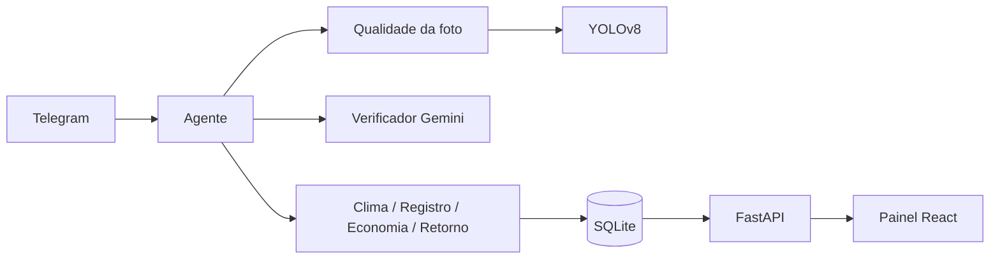

# GuarAssist

Bot de Telegram que identifica pragas e doenças do guaraná por foto ou áudio. O produtor manda a imagem, o sistema roda um modelo YOLOv8 treinado com fotos de guaraná, confere o resultado com um segundo modelo e responde com o diagnóstico, o manejo recomendado e o melhor dia para aplicar produto. Casos confirmados vão para um mapa e, quando se acumulam numa região, os produtores próximos recebem um alerta.

Feito para o AKCIT Camp 2026.

## Como funciona

1. O produtor envia foto ou áudio pelo Telegram.
2. A foto passa por uma checagem de qualidade. Se estiver escura, o contraste é ajustado. Se estiver tremida ou muito pequena, o bot pede outra.
3. O YOLO e um verificador (Gemini com visão) analisam a imagem em paralelo.
4. O código cruza as duas respostas e define o resultado.
5. O agente registra o caso, consulta a previsão do tempo, calcula a economia de tratar só as plantas afetadas e agenda um retorno.
6. A resposta sai em texto e, se o produtor mandou áudio, também em voz.



## Validação dos diagnósticos

O modelo sozinho gerava falsos positivos e marcava como saudável qualquer imagem sem detecção. Por isso o resultado final depende das duas análises:

| YOLO | Verificador | Resultado |
|---|---|---|
| qualquer | não é guaraná ou foto ruim | rejeitada, pede nova foto |
| praga | sem sintoma | inconclusivo, pede foto mais de perto |
| praga (≥ 50%) | sintoma compatível | confirmado |
| praga (< 50%) ou tipo diferente | sintoma | provável, vai para o técnico |
| nada | sintoma | suspeita, vai para o técnico |
| nada | nada | saudável |

Só casos confirmados contam para alerta de surto. Sem o Gemini disponível, o bot responde só com o YOLO e não dispara alertas.

## Stack

Python, FastAPI, SQLite, Ultralytics YOLOv8, OpenCV, Google Gemini, python-telegram-bot, React e Open-Meteo.

## Rodando localmente

Requisitos: Python 3.9+, Node 18+, um token do [@BotFather](https://t.me/BotFather) e uma chave do [Google AI Studio](https://aistudio.google.com/apikey).

```bash
cd backend
python3 -m venv .venv
source .venv/bin/activate
pip install ultralytics fastapi uvicorn pillow opencv-python-headless python-multipart
pip install -r requirements-agent.txt
cp .env.example .env   # preencher TELEGRAM_TOKEN e GEMINI_API_KEY
```

```bash
python testar_agente.py        # testa o agente no terminal
python bot_telegram.py         # sobe o bot
uvicorn main:app --reload      # sobe a API
```

Painel:

```bash
cd frontend
npm install
npm run dev
```

### Comandos do bot

- `/start` inicia e pede a localização
- `/tecnico` marca o chat como técnico
- `/area 3` salva a área em hectares
- `/resumo` mostra os números gerais
- `/reset` limpa o histórico da conversa

## Configuração

As variáveis ficam em `backend/.env`. O modelo completo está em `backend/.env.example`.

| Variável | Uso |
|---|---|
| `TELEGRAM_TOKEN` | token do bot |
| `GEMINI_API_KEY` | chave do Gemini |
| `GEMINI_MODEL` | modelo principal |
| `GEMINI_MODELOS_RESERVA` | modelos usados se o principal estiver sobrecarregado |
| `MIN_CASOS_SURTO` / `RAIO_SURTO_KM` | regra de surto (padrão: 3 casos em 10 km) |
| `RESPOSTA_EM_AUDIO` | `auto`, `sempre` ou `nunca` |
| `VOZ_MOTOR` / `VOZ_NOME` | motor e voz da resposta falada |

## Estrutura

```
backend/
  agent/
    core.py          loop do agente
    tools.py         ferramentas (diagnóstico, registro, clima, economia, retorno)
    verificador.py   segunda análise e regra de resultado
    imagem.py        qualidade e correção da foto
    llm.py           cliente Gemini com retentativas
    voz.py           texto para fala
    prompt.py        comportamento do agente
    conhecimento.py  pragas e manejo (fonte: Embrapa)
    store.py         banco e consultas por distância
  models/            detector YOLO e pesos treinados
  routes/            rotas da API
  bot_telegram.py
  main.py
frontend/            painel React
```

## API

| Rota | Descrição |
|---|---|
| `POST /api/analyze` | análise de imagem pelo painel |
| `GET /api/history` | histórico |
| `GET /api/stats` | resumo do dashboard |
| `GET /api/ocorrencias` | casos registrados pelo bot, com coordenadas |
| `GET /api/ocorrencias/resumo` | confirmados, pendentes, surtos e economia |

Documentação em `http://localhost:8000/docs`.

## Limitações

- O dataset ainda é pequeno e formado em boa parte por capturas de tela. Mancha angular e oídio não têm imagens de treino.
- O diagnóstico é uma triagem. Uso de defensivo depende de receituário agronômico.
- A economia é uma estimativa com parâmetros de referência.
- O histórico da conversa fica em memória e se perde ao reiniciar o bot.

## Próximos passos

- Versão para WhatsApp
- Modelo em TFLite rodando offline no celular
- Alerta de surto por SMS
- Retreino com fotos de campo validadas por técnicos
- Outras culturas da região, como cupuaçu e açaí

## Equipe

Icaro Costa ([@icarowt](https://github.com/icarowt)), Gabriel Maximiano, Daniel Alves Pinheiro, Eliel Alves Pinheiro e M. S. Ribeiro.

## Licença

MIT. Veja [LICENSE](LICENSE).
